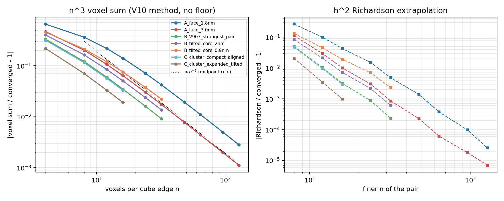
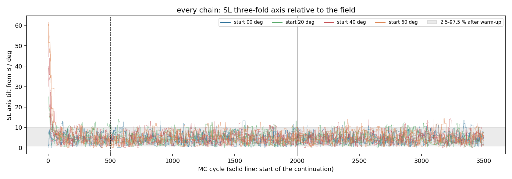
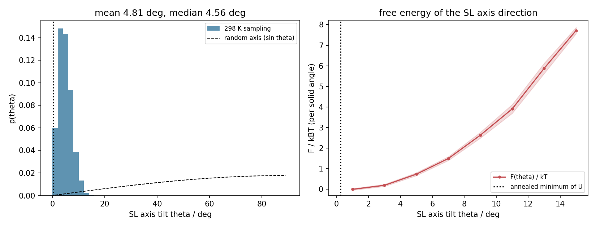
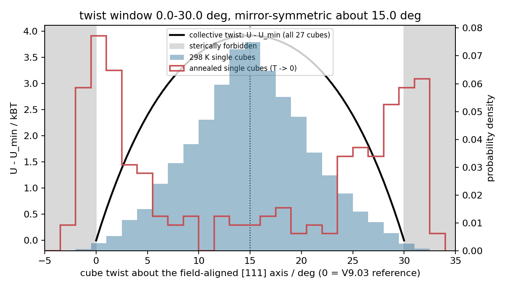

# Tilted nanocube superlattices: Monte Carlo (V9.04)

Monte Carlo model of a 3 x 3 x 3 rhombohedral superlattice (SL) of 16 nm
Fe3O4 nanocubes in a 500 G field at 298.15 K.  It supports Section S16 of the
Supporting Information of *In Situ SAXS/WAXS Exposes Competing Magnetic and
van der Waals Interactions in Temperature- and Field-Driven Assembly of Fe3O4
Nanocubes* (Mi, Jeong, Lin, Lee, Irvine, Talapin).

V9.04 replaces V9.03.  The V9.03 code and outputs cited in earlier drafts of
the SI are preserved at the git tag [`v9.03`](../../tree/v9.03).

## Main results

| question | answer | where |
|---|---|---|
| Is the van der Waals (vdW) term converged? | Yes. The sharp-cube Hamaker integral is evaluated at its voxel limit; n^3 voxel sums converge onto it as n^-2. The V9.03 4^3 sum was 2.9x too weak at a 1.8 nm face gap. | `outputs/vdw_convergence/` |
| Does a free 27-cube cluster stay together at 298 K? | No. The lattice is 74 kBT lower in energy than the dispersed cluster, but releasing 26 caged cubes gains roughly 700 kBT of entropy; the cluster dissolves within ~300 cycles. Even a single pair is unbound. | `outputs/production/`, `outputs/pair_binding/` |
| Given that the SL exists, how far does its axis tilt from B? | The SL three-fold axis stays in a cone around B: 95 % of 48 000 samples in 0.9-10.2 deg, all in 0.03-14.5 deg, in every one of 16 chains from starts at 0, 20, 40 and 60 deg. The free energy per solid angle is minimal at 0 deg (about 220 kBT/rad^2). | `outputs/lattice_per_chain/`, `outputs/lattice_production_cont/` |
| What is the lowest-energy structure? | Simulated annealing (8 restarts): SL axis, cube [111] axes and moments all along B (tilt 0.06-0.31 deg). | `outputs/lattice_anneal/` |
| Can a cube rotate inside the lattice? | Only about [111]: a 30 deg twist window, mirror-symmetric about its centre. At 298 K the cubes fluctuate about the achiral centre (+-5.8 deg); at T -> 0 each cube sits at one of the two mirror-image walls. The lattice cannot rotate independently of its cubes. | `outputs/twist_window/` |

The observed tilted SL orientation, [1 1.4 1]\*SL parallel to B, is a 13.7 deg
tilt.  An isolated domain reaches it in only 0.07 % of samples (about 6.5 kBT
per solid angle above the minimum), so within this model it is not a
single-domain equilibrium state.






## Changes relative to V9.03

| | V9.03 | V9.04 |
|---|---|---|
| vdW | sharp-cube Hamaker sum, 4^3 voxels, d^2 >= 1e-19 m^2 floor, cutoff 2.2 a | the same integral at its voxel limit (no floor, no cutoff), via an exact surface reduction |
| hard core | none beyond the rounded-support steric spring | sharp cores at least D0 = 0.165 nm apart (Hamaker contact cutoff) |
| target distribution | positions unbounded: not normalisable | (1) Stillinger cluster ensemble; (2) rigid-lattice ensemble |
| moves | translation + rotation as one move, 0.03 nm / 2 deg | separate moves, two-scale mixtures, steps tuned by mean squared jump distance |
| optimisation | none | simulated annealing of the total energy with independent restarts |
| diagnostics | R-hat, ESS, MCSE | plus tau_int, batch-means MCSE, Geweke, MSER-5, per-start distributions, split windows, stability runs |

Zeeman, first-order cubic anisotropy, point dipoles and the rounded-support
steric spring are unchanged; `tests/test_model.py` checks them term by term
against the V9.03 code (bundled in `reference/v903_cells/`).

## Model

    U = E_Z + E_ani + E_dd + E_vdW + E_steric

- E_Z = -m B . sum_i mu_i, m = Ms L^3, Ms = 2.85e5 A/m, B = 0.05 T
- E_ani = -K V sum_i (mx^2 my^2 + mx^2 mz^2 + my^2 mz^2), K = 2.0e4 J/m^3
- E_dd: point dipoles
- E_vdW = -(A/pi^2) int int dV1 dV2 / r^6 over two sharp cubes, A = 20 zJ
- E_steric: spring k = 1e8 J/m^2 below a 1.8 nm rounded-support gap (rounding 1.5 nm)

The vdW integral is reduced exactly, by Gauss's theorem applied to each cube,
to 36 face-pair integrals of (n_i . n_j) R^-4.  The inner face integral has
a closed form; the outer one is done by Gauss rules, refined adaptively near
contacts until each panel is small compared with its distance to the other
face.  An independent octree volume integration agrees to 3.6e-6.

Two ensembles are used.  In both the state space is compact and
exp(-U/kT) is normalisable.

1. **Cluster ensemble** (`schedule: cluster`): free positions, bodies and
   moments.  The cluster is defined by a connected bond graph (centre
   distance < 30 nm, Stillinger).  Used to show that the SL is not
   self-bound.
2. **Rigid-lattice ensemble** (`schedule: lattice`): positions fixed on the
   experimental lattice (a = 21 nm, alpha = 74.2 deg), which rotates only
   as a whole (G in SO(3)).  Samples every cube's body orientation, every
   moment and G.  This answers what happens given that the SL exists.

## Monte Carlo

Metropolis-Hastings with symmetric proposals: translation, body rotation,
moment rotation, co-tilt (rigid rotation of lattice and bodies), twist about
the mean [111] axis, dilation (with its 3(N-1) log-scale Jacobian) and
lattice rotation.  Constraint violations are rejections.  Steps are tuned in
pilots only (`scripts/pilot_tuning*.py`), then frozen, with fresh seeds for
production.  Warm-up is fixed before each run.  Energy caches are checked
against fresh evaluations every 250 cycles (drift gate 1e-6 kBT).
Annealing (`v904/anneal.py`) uses the same kernels with a geometric kT
schedule and adaptive steps; independent restarts and a local test check
its result.

## Validation

`python -m unittest discover -s tests -v` runs 31 tests.  Among them:

- the vdW evaluator against voxel sums, V10's numbers and octree integration;
- V9.03 regression;
- exact energy bookkeeping for every move;
- every kernel against an independent answer: Haar measure, sphere
  quadrature, i.i.d. importance sampling, a 1D Jacobian test with a
  negative control, a pair-orientation quadrature, and a grid minimum for
  annealing.

## Reproduce

```bash
python -m pip install -r requirements.txt
python -m unittest discover -s tests -v
python scripts/vdw_convergence.py
# cluster ensemble
python scripts/run_chains.py configs/pilot_relax.json outputs/pilot_relax --workers 4
python scripts/pilot_tuning.py outputs/pilot_relax outputs/pilot_tuning --tag round1
python scripts/pilot_tuning.py outputs/pilot_relax outputs/pilot_tuning --tag round2 --factors 4,8,16,32,64
python scripts/make_v2_sources.py outputs/production_v1_energy_hole outputs/v2_sources
python scripts/run_chains.py configs/production.json outputs/production --workers 16
python scripts/analyze.py outputs/production --equil 1000
# rigid-lattice ensemble and annealing
python scripts/pilot_tuning_lattice.py configs/lattice_production.json outputs/pilot_tuning_lattice
python scripts/run_chains.py configs/lattice_production.json outputs/lattice_production --workers 16
python scripts/run_chains.py configs/lattice_production_cont.json outputs/lattice_production_cont --workers 16
python scripts/run_chains.py configs/lattice_anneal.json outputs/lattice_anneal --workers 8
python scripts/analyze.py outputs/lattice_production_cont --equil 0
python scripts/analyze_anneal.py configs/lattice_anneal.json outputs/lattice_anneal
python scripts/lattice_per_chain.py outputs/lattice_per_chain
python scripts/plot_lattice_tilt.py outputs/lattice_production_cont 0 outputs/lattice_anneal outputs/lattice_production_cont
python scripts/twist_window.py outputs/twist_window
# SI Figure S21B (free-cluster history, v1 relaxation + v2)
python scripts/plot_history.py outputs/production_v1_energy_hole outputs/production outputs/production/history_si.png --hide-discarded --keys=rg_nm,n_bonds,vdw_kBT,energy_kBT
```

Run from the repository root with `PYTHONPATH=.`.  Runs are resumable: a
chain is complete only when its `complete.json` exists.  The config of the
archived first cluster run is in
`outputs/production_v1_energy_hole/manifest.json`.

## Layout

- `v904/`: model, vdW evaluator, geometry and constraints, sampler,
  annealing, diagnostics
- `tests/`: 31 unit tests
- `scripts/`: runners, pilots, analysis and figures
- `configs/`: settings of every run (`configs/README.md` lists them)
- `outputs/`: data, reports and figures of every run
- `docs/`: step-by-step explanations in Chinese
  - `MC_WORKFLOW_ZH.md`: MC workflow and checks
  - `RIGID_LATTICE_ZH.md`: why the cluster dissolves; rigid-lattice results
- `reference/`: V9.03 energy code for the regression test

## Limitations

- The vdW integral runs over sharp cubes, following V10, while the steric
  wall uses rounded cubes.  The D0 core minimum closes the resulting
  divergence.  At T -> 0, 1-2 kBT of the annealed vdW comes from contacts
  near D0.
- The rigid-lattice ensemble conditions on the SL existing.  It says
  nothing about whether the SL forms.
- In the rigid lattice, the cubes' internal twist and off-axis tilt
  relax slowly (tau ~ 1200 cycles) and are reported as intervals, not
  converged means.
- MC cycles are not physical time.
