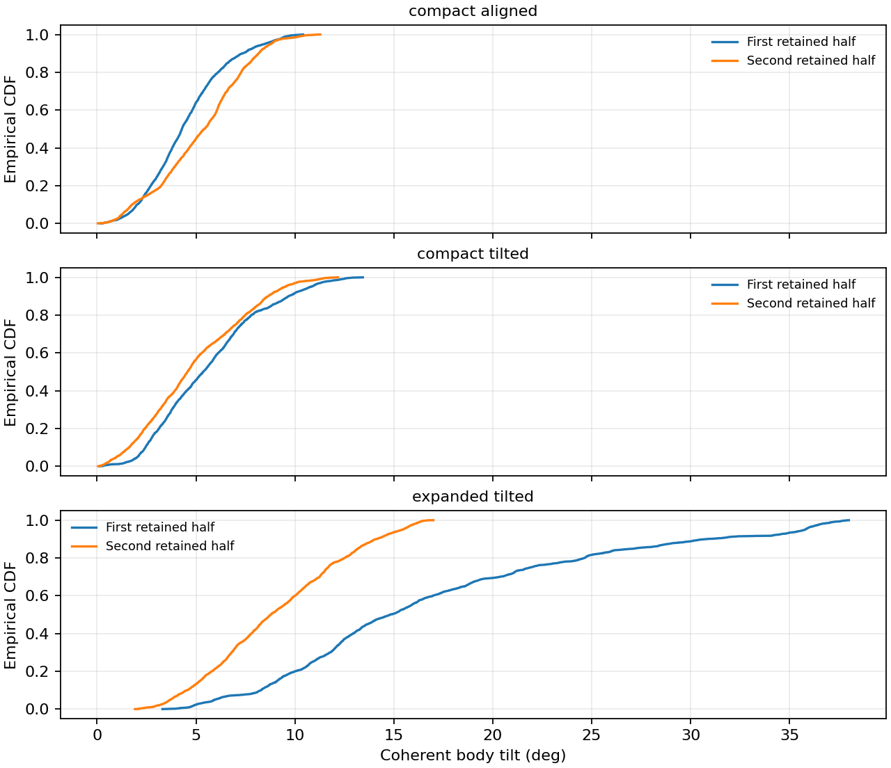
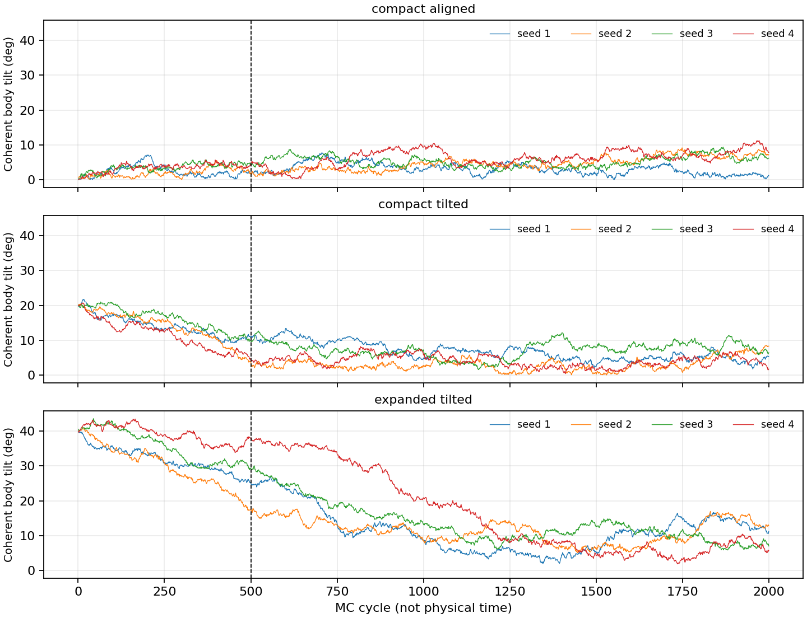
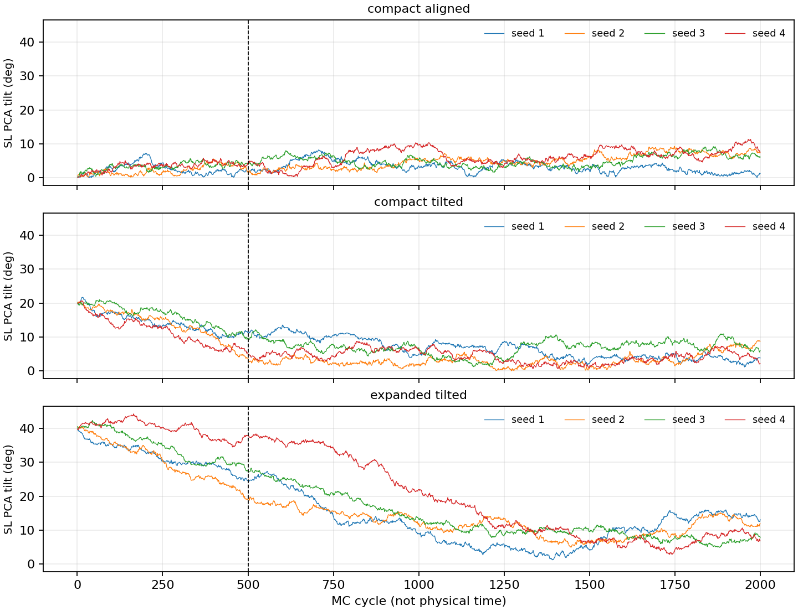
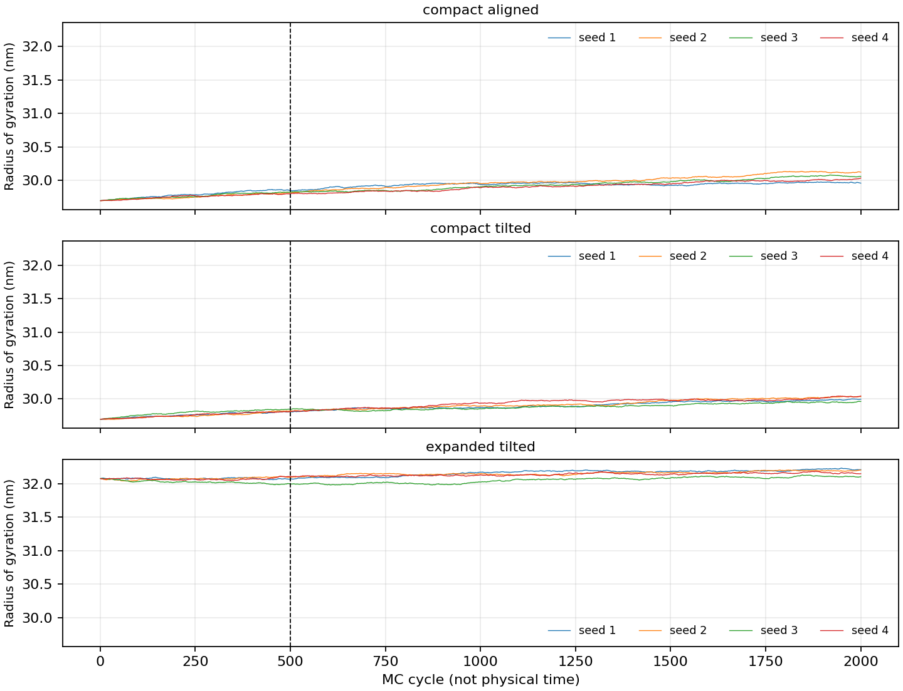
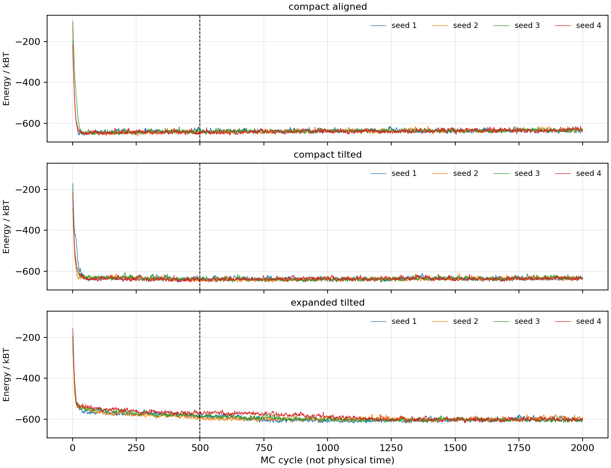

# Body tilt 的稳定性与诊断解释

数据来自 `../sampling_2000cycles_20260915/`，代码版本为 `3e5eb44` 中记录的实验。此处只分析已保存轨迹，没有重新计算或修改旧数据。

## 核心判断

R-hat 大、ESS 小，不能证明 body tilt 不存在稳定分布。它们说明这批样本尚不能可靠描述该分布。稳定分布允许角度持续波动，不要求角度固定不变，也不保证稳定的非零倾角。

| 变量 | rank split R-hat | bulk ESS | tail ESS | MCSE(mean) |
|---|---:|---:|---:|---:|
| body tilt | 1.8298 | 17.446 | 26.688 | 1.5013° |
| SL PCA tilt | 1.8071 | 17.654 | 26.059 | 1.5605° |

这批数据有 12 条链，每条保留 1500 个 cycle，共 18000 个记录。

- R-hat 比较链间与链内差异，也用分半链检测前后变化。rank 版本包含 folded 检查。1.83 不是未收敛百分比，不能换算为还要运行多少倍时间。
- bulk ESS 是分布主体的有效信息量估计，包含自相关及链间不一致的影响。当前链非平稳，不能严格声称已有 17 个独立平衡样本。
- MCSE 是有限采样带来的均值误差估计，不包括未收敛偏差或物理模型误差。不能将当前 MCSE 用作已验证平衡角的误差条。

方法见 [Vehtari et al.](https://arxiv.org/abs/1903.08008) 与 [Stan 诊断说明](https://mc-stan.org/rstan/reference/Rhat.html)。

## 分布是否仍在变化

将保留段分成 cycles 501–1250 和 1251–2000。下面的经验累积分布将同一初态下四个 seed 合并，仅用于描述时间窗口差异，不用于替代逐链诊断。

膨胀初态的平均 body tilt 从前段 17.1323° 降至后段 9.1049°，分布明显左移。紧密初态的前后均值分别为 4.5016°/5.2365° 与 5.6495°/4.9155°。这些数据支持初态尚未充分忘记。

## 分开的 body 与 SL 轨迹

虚线是原定 500-cycle warm-up 的结束位置。膨胀初态在此之后仍有较长松弛段。body 与 SL 基本同步并不意味着它们各自已经平衡。

## 尺寸和能量

膨胀与紧密初态的 Rg 仍分离。总能量较快降低，不能排除尺寸或转角慢变量。

## 模型边界与下一步

当前模型固定中心，但其他位置自由度无界。一个非中心颗粒远离团簇时，排斥项为零，vdW 超过截断后为零，偶极能衰减，单颗粒磁能保持有限。因此无限位置空间上的完整玻尔兹曼权重不能归一化。这是独立于 R-hat 的模型边界问题，不等于角度本身一定没有稳定分布。

固定几何后的磁矩条件分布定义明确，可以先标定磁 sweep 数。联合运行只能先检查有限采样窗口中的混合。完整平衡或非零稳定倾角的结论，需要进一步明确物理边界与目标分布。本次未修改相互作用势或添加约束。
