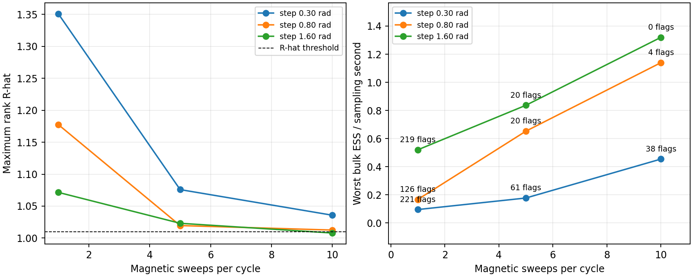
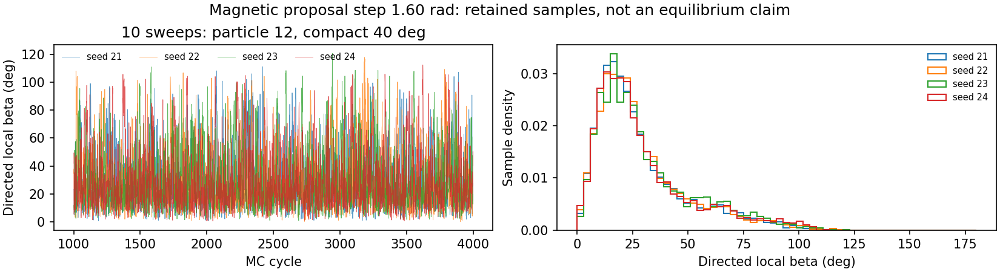
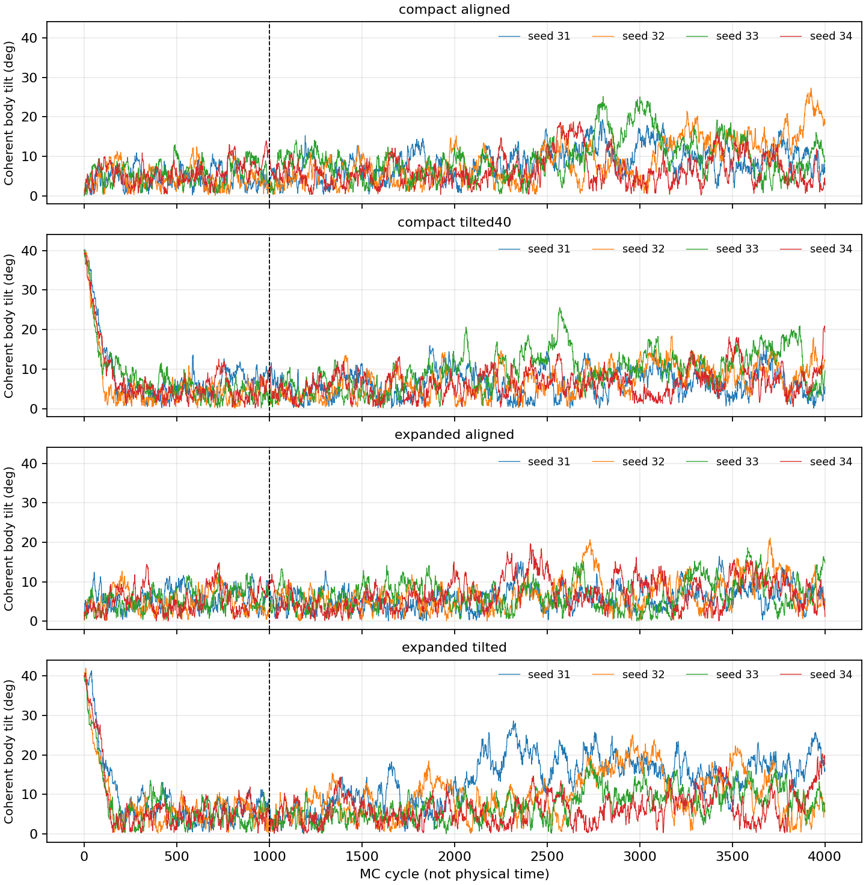
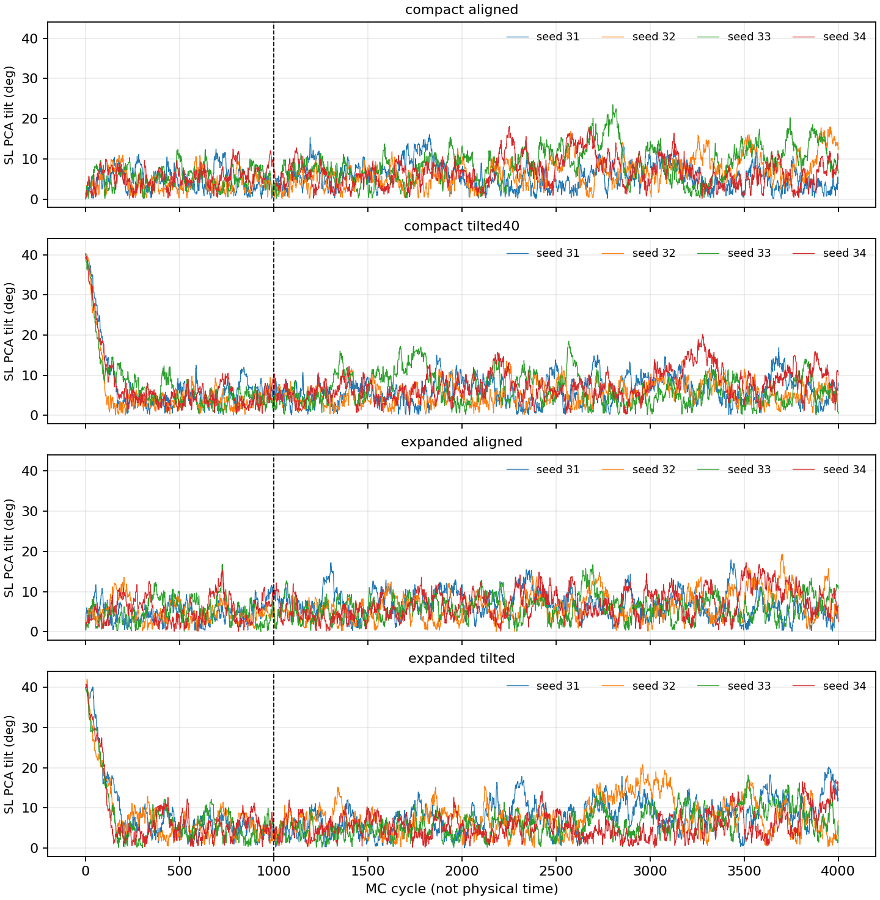
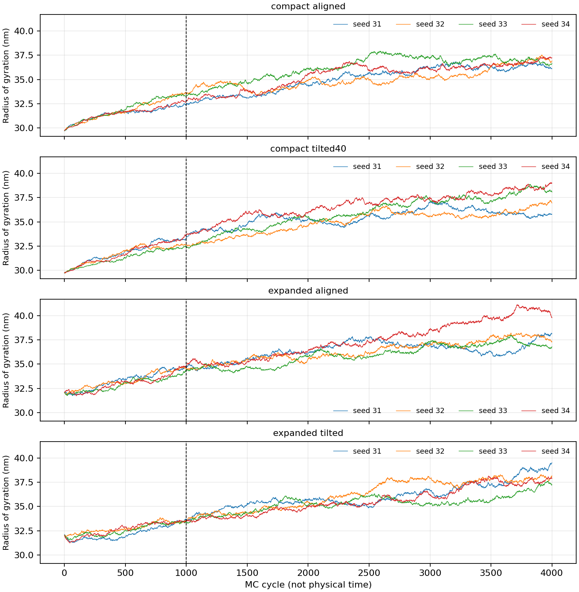
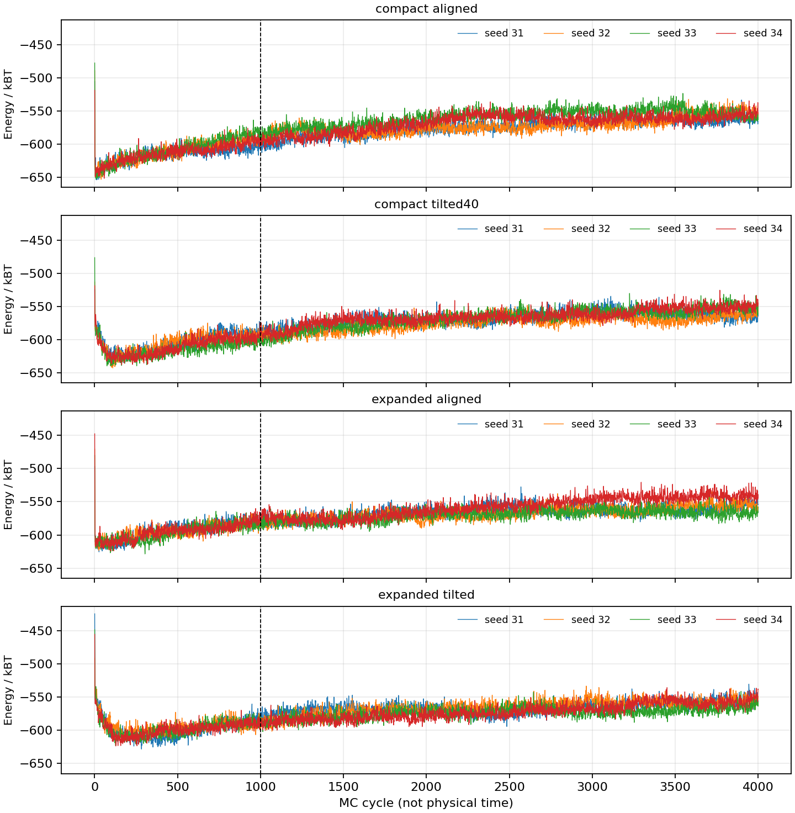
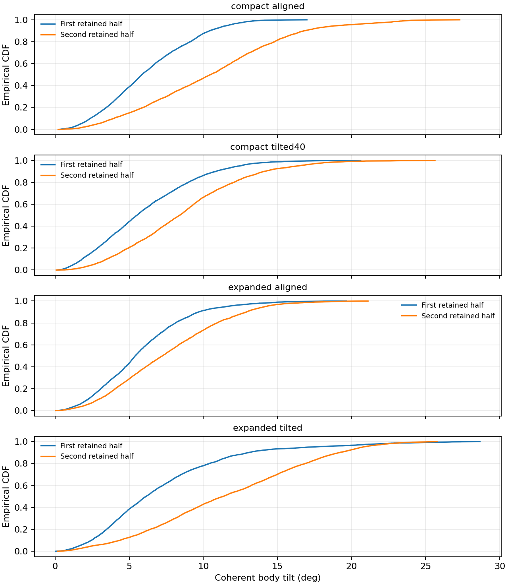

# V9.03 采样优化与独立验证

## 结论

磁标定选择 1.60 rad、每 cycle 10 个完整磁 sweep。这是九组候选中唯一通过全部试跑检查的设置。
独立磁验证：全部通过。
联合验证：仍有未通过项目，不能声称整体平衡。
完整位置空间仍无界，任何诊断通过都不能解决目标权重不可归一化的物理边界问题。
vdW、磁能和 steric 公式及参数保持不变，没有添加构型熵能量项。

## 试跑比较

四种冻结几何，每种四条链，每条 2000 cycles，舍弃前 500。
每组候选监测 232 个几何/变量组合，含逐颗粒磁矩投影与 local beta。
下表的 flags 是未通过的组合数。未通过候选的 ESS/秒只作为诊断分数，不是已经验证的精度效率。

| 磁提议最大角 / rad | sweeps | 最大 R-hat | 最小 bulk ESS | 最差 bulk ESS/秒 | flags / 232 |
|---:|---:|---:|---:|---:|---:|
| 0.30 | 1 | 1.3509 | 9.5216 | 0.095835 | 221 |
| 0.30 | 5 | 1.0758 | 44.677 | 0.1778 | 61 |
| 0.30 | 10 | 1.0357 | 197.09 | 0.4546 | 38 |
| 0.80 | 1 | 1.1775 | 18.344 | 0.16758 | 126 |
| 0.80 | 5 | 1.0196 | 165.95 | 0.65289 | 20 |
| 0.80 | 10 | 1.0125 | 544.89 | 1.1398 | 4 |
| 1.60 | 1 | 1.0715 | 54.53 | 0.5205 | 219 |
| 1.60 | 5 | 1.0231 | 213.33 | 0.83684 | 20 |
| 1.60 | 10 | 1.0079 | 583.31 | 1.3198 | 0 |

## 独立磁验证

四种冻结几何 × seeds 21–24，每条 4000 cycles，前 1000 为 warm-up。
初始化仍包括随机、顺场、逆场和 body easy-axis，采样流与试跑分开。
232 个组合中 0 个未通过。
最大 R-hat = 1.003，最小 bulk ESS = 1129.02。

### compact_aligned

| 变量 | R-hat | bulk ESS | tail ESS | mean ESS | MCSE(mean) | 状态 |
|---|---:|---:|---:|---:|---:|---|
| energy_kBT | 1.0013 | 5607.1 | 8991.7 | 5529.4 | 0.077423 | checks_passed |
| local_beta_deg | 1.0012 | 5716.4 | 9384.4 | 5673.3 | 0.019655 | checks_passed |
| magnetization | 1.001 | 6233.3 | 9631.4 | 6312.8 | 0.00011089 | checks_passed |

### compact_tilted40

| 变量 | R-hat | bulk ESS | tail ESS | mean ESS | MCSE(mean) | 状态 |
|---|---:|---:|---:|---:|---:|---|
| energy_kBT | 1.0002 | 5355.8 | 8750.2 | 5336.5 | 0.079796 | checks_passed |
| local_beta_deg | 1.001 | 2958.6 | 5682.7 | 2936.1 | 0.059943 | checks_passed |
| magnetization | 1.0004 | 3131.5 | 5601.3 | 3097.4 | 0.00037314 | checks_passed |

### expanded_aligned

| 变量 | R-hat | bulk ESS | tail ESS | mean ESS | MCSE(mean) | 状态 |
|---|---:|---:|---:|---:|---:|---|
| energy_kBT | 1.0003 | 5913.5 | 8585.7 | 5930.8 | 0.074478 | checks_passed |
| local_beta_deg | 1.0003 | 5953.3 | 8507.4 | 5953.2 | 0.018616 | checks_passed |
| magnetization | 1.0005 | 6351.2 | 8705.3 | 6384 | 0.00010243 | checks_passed |

### expanded_tilted

| 变量 | R-hat | bulk ESS | tail ESS | mean ESS | MCSE(mean) | 状态 |
|---|---:|---:|---:|---:|---:|---|
| energy_kBT | 1.0016 | 5438.9 | 8455.4 | 5434.3 | 0.080179 | checks_passed |
| local_beta_deg | 1.0012 | 4402.2 | 7173.7 | 4380.6 | 0.047052 | checks_passed |
| magnetization | 1.0005 | 5420.5 | 7955.8 | 5278 | 0.00024751 | checks_passed |

图示 compact 40° 中第 12 个颗粒，四个新 seed 的 local-beta 主体与尾部分布基本一致。数值检查覆盖全部 27 个颗粒，不能只凭这一张图判断。

## 独立联合验证

四种初态 × seeds 31–34，每条 4000 cycles，前 1000 为 warm-up。
磁参数固定为 1.60 rad、10 sweeps。整体 co-tilt 最大 3°。
每 cycle 另尝试一次中心坐标整体缩放，最大 log-scale 为 0.002，并包含 78×log(scale) 的 MH 修正。
该修正维持原有 Cartesian 采样测度，不是添加新的物理熵模型。

| 变量 | R-hat | bulk ESS | tail ESS | mean ESS | MCSE(mean) | 状态 |
|---|---:|---:|---:|---:|---:|---|
| energy_kBT | 1.4479 | 31.218 | 56.755 | 31.349 | 2.1899 | high_rhat,low_ess |
| local_beta_deg | 1.753 | 23.999 | 61.662 | 22.455 | 1.4447 | high_rhat,low_ess,high_mcse |
| body_tilt_deg | 1.1915 | 59.192 | 79.275 | 49.715 | 0.66285 | high_rhat,low_ess,high_mcse |
| sl_pca_tilt_deg | 1.0729 | 143.02 | 266.11 | 125.23 | 0.32054 | high_rhat,low_ess |
| body_sl_difference_deg | 1.2139 | 60.098 | 85.936 | 54.505 | 0.52429 | high_rhat,low_ess |
| body_sl_axis_angle_deg | 1.6255 | 26.415 | 74.427 | 24.222 | 0.6461 | high_rhat,low_ess |
| magnetization | 1.0711 | 134.4 | 522.9 | 133.78 | 0.0011013 | high_rhat,low_ess |
| abs_muB | 1.0711 | 134.36 | 522.9 | 133.73 | 0.0011014 | high_rhat,low_ess |
| body_order | 2.0246 | 21.436 | 43.396 | 20.515 | 0.014461 | high_rhat,low_ess |
| sl_pca_order | 2.3248 | 19.945 | 22.399 | 18.376 | 0.00090815 | high_rhat,low_ess |
| min_gap_nm | 1.1115 | 89.021 | 53.74 | 42.262 | 0.034663 | high_rhat,low_ess |
| rg_nm | 1.8963 | 22.488 | 35.18 | 22.231 | 0.29935 | high_rhat,low_ess |

R-hat < 1.01，pooled ESS 门槛为 1600，四链组内门槛为 400。
body/SL 的均值 MCSE 目标为 0.5°，local beta 为 0.25°，signed magnetization 为 0.002。
不同观测量可能混合速度不同，不能用 body tilt 的通过代替全部结构自由度的通过。

| 初态 | body tilt 均值 / deg | SL tilt 均值 / deg | Rg 均值 / nm | co-tilt 接受率 | scale 接受率 |
|---|---:|---:|---:|---:|---:|
| compact_aligned | 8.3942 | 7.0637 | 35.455 | 0.7975 | 0.79331 |
| compact_tilted40 | 7.3497 | 6.4505 | 35.803 | 0.79475 | 0.79506 |
| expanded_aligned | 6.691 | 6.6327 | 36.571 | 0.79894 | 0.85744 |
| expanded_tilted | 9.4137 | 6.9086 | 35.834 | 0.80331 | 0.82294 |

### 初态组内诊断

每组四条链分别检查。组内通过仍不能代替不同初态间的一致性。

| 初态 | body R-hat | body bulk ESS | body MCSE / deg | 未通过变量数 / 12 |
|---|---:|---:|---:|---:|
| compact_aligned | 1.2003 | 14.459 | 1.2863 | 12 |
| compact_tilted40 | 1.163 | 18.483 | 0.98425 | 12 |
| expanded_aligned | 1.0508 | 64.385 | 0.48382 | 12 |
| expanded_tilted | 1.2914 | 11.163 | 1.8189 | 12 |

### 保留样本的前后时间窗口

每个窗口先在链内取均值，再平均同初态的四条链。

| 初态 | cycle 窗口 | body tilt / deg | SL tilt / deg | Rg / nm | body order | body-SL 轴夹角 / deg |
|---|---|---:|---:|---:|---:|---:|
| compact_aligned | 1001–2500 | 6.227 | 6.2274 | 34.563 | 0.93018 | 3.523 |
| compact_aligned | 2501–4000 | 10.561 | 7.9 | 36.347 | 0.83323 | 8.0185 |
| compact_tilted40 | 1001–2500 | 6.0242 | 6.1058 | 34.808 | 0.9361 | 4.3984 |
| compact_tilted40 | 2501–4000 | 8.6753 | 6.7951 | 36.798 | 0.85732 | 6.7603 |
| expanded_aligned | 1001–2500 | 5.7936 | 6.3366 | 35.628 | 0.91027 | 3.2479 |
| expanded_aligned | 2501–4000 | 7.5883 | 6.9288 | 37.514 | 0.80294 | 4.1961 |
| expanded_tilted | 1001–2500 | 7.2354 | 5.7949 | 34.86 | 0.9235 | 3.9051 |
| expanded_tilted | 2501–4000 | 11.592 | 8.0223 | 36.809 | 0.82857 | 6.1713 |

均值使用 warm-up 后的轨迹，接受率使用完整运行。未收敛变量的均值只作为描述统计。
body order 越低，颗粒本体的方向越分散。body-SL 轴夹角与两个 tilt 的差值分别记录，两者不能互换。

## 如何理解旧结果 R-hat≈1.83、bulk ESS≈17.4

它们表明旧样本尚未一致、稳定地探索 body tilt 分布，不证明该角度不存在稳定态。
有限温度下稳定的是概率分布，角度可以持续波动。正的平均夹角也不能单独证明非零倾角的自由能最低点。
旧实验有 18000 个保留记录，但自相关和初态差异使有效信息量很低。非平稳时不能把 17.4 严格当成独立平衡样本数。
MCSE 只估计采样误差，不覆盖未收敛偏差。旧膨胀初态前后窗口的 body tilt 均值由 17.13° 降到 9.10°，是持续松弛的直接证据。

当前模型在某个非中心颗粒无限远离时，能量趋于有限值，位置体积积分却发散。
因此完整无界位置空间没有可归一化的玻尔兹曼分布。固定几何的磁条件分布则可以归一化。
后续完整平衡结论需要明确物理边界、有限密度或团簇条件。本次没有擅自添加这些约束。

## 数值核验与文件

- 共验证 176 条新链。所有轨迹和已估计诊断值为有限数值。
- 最终全量能量与累计能量的最大误差为 2.353e-11 kBT。
- 全部记录的最小现有投影 gap 为 1.79999 nm。该检查不替代独立的真实凸体几何验证。
- 磁矩长度、姿态矩阵正交性及 source snapshot SHA256 均通过检查。
- 23 项回归测试通过，包含前部机械开关、MH 非对称提议、单磁矩球面积分参考和缩放 Jacobian 的 78 维高斯参考。
- 每个实验目录保存 diagnostics.csv、chains.csv、windows.csv、manifest.json、finished.json 和逐链 NPZ/JSON。
- 试跑与独立验证分开。联合和磁验证同时执行，验证阶段的运行时间不能直接用于与试跑比较加速倍数。

方法：[Vehtari et al.](https://arxiv.org/abs/1903.08008)，[Stan 诊断说明](https://mc-stan.org/learn-stan/diagnostics-warnings.html)。
